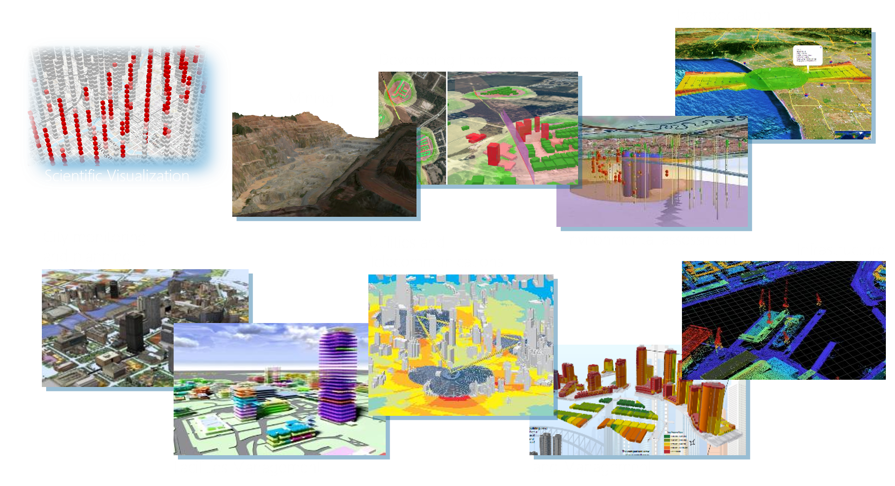
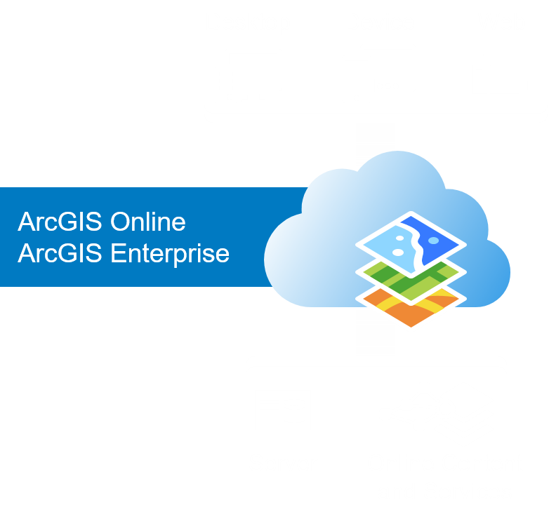
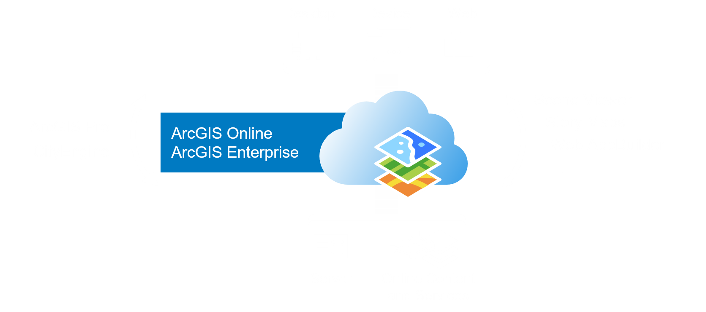
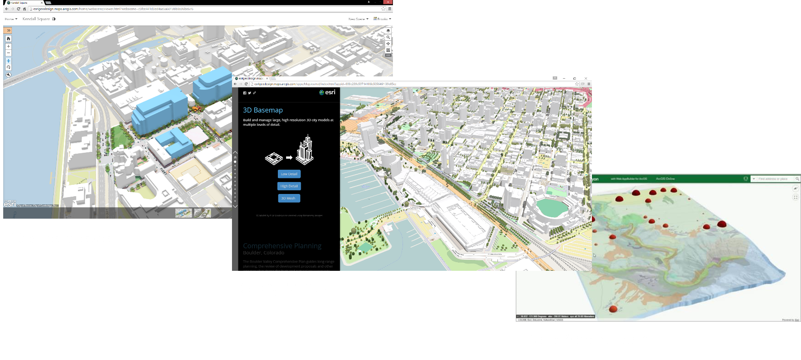
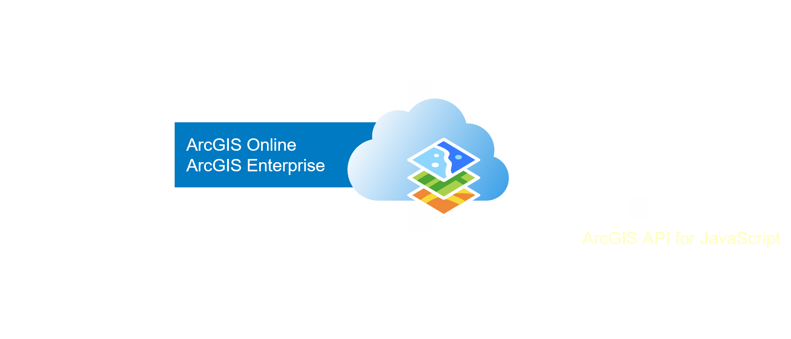
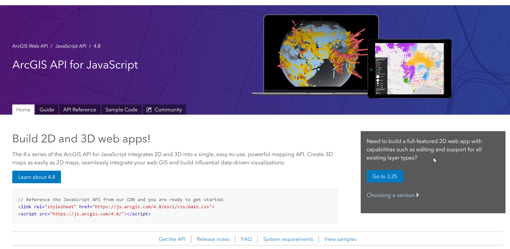

<!-- .slide: data-background="../images/bg-1.png" -->

## Building 3D Apps   with ArcGIS API for JavaScript

Veronika Landers - Yannik Messerli - Johannes Schmidt

---

<!-- .slide: data-background="../images/bg-2.png" -->

### <b> 3D GIS across industries</b>

 

---

<!-- .slide: data-background="../images/bg-2.png" -->

### <b> 3D GIS across industries</b>

 

<iframe id="scene-view-map-view" data-src="https://www.arcgis.com/home/webscene/viewer.html?webscene=c5b58fa63714412eb0eea933a130ebdf&ui=min" height=500 align=left></iframe>

<iframe id="scene-view-map-view" data-src="https://www.arcgis.com/home/webscene/viewer.html?webscene=43e1b988e55a44fdad6c5cf58c34dbda&ui=min" height=500></iframe>

---

<!-- .slide: data-background="../images/bg-1.png" -->
### <b>Agenda</b>

- Introduction
- API Concepts
- Publishing Content
- Building your first app
- Extend your app
- Samples

---

<!-- .slide: data-background="../images/bg-4.png" -->

## <b>Introduction</b>

 

Veronika Landers

---

<!-- .slide: data-background="../images/bg-2.png" -->

### <b>The ArcGIS Platform</b>

---

<!-- .slide: data-background="../images/bg-2.png" -->

### <b>The ArcGIS 3D Platform</b>

---

<!-- .slide: data-background="../images/bg-2.png" -->

### <b>Esri Provides out-of-the-box 3D Web Apps</b>

---

<!-- .slide: data-background="../images/bg-2.png" -->

### <b>Building Apps with the ArcGIS 3D Platform</b>

---

<!-- .slide: data-background="../images/bg-2.png" -->

### <b>Build Your Own custom 3D Web Apps</b>

---

<!-- .slide: data-background="../images/bg-2.png" -->
### <b>ArcGIS JavaScript API</b>

 

---

<!-- .slide: data-background="../images/bg-2.png" -->
### <b>ArcGIS JavaScript API</b>

  - Visual mapping (2D & 3D), component and widgets
  - Support for various different layer types (data sources)
  - Integration with the ArcGIS platform
     (security, sign-in, premium services, …)

 

<b>Get it today</b>
- Hosted build https://js.arcgis.com/4.8   
- Doc/samples https://developers.arcgis.com/javascript

---

<!-- .slide: data-background="../images/bg-2.png" -->

### <b>Desktop 3D Requirements</b>

 

- Modern hardware, especially Graphics Card

- Latest web browsers with WebGL support
  - Chrome
  - Edge / Internet Explorer 11* (* not optimized)
  - Firefox
  - Safari

---

<!-- .slide: data-background="../images/bg-2.png" -->

### <b>Mobile 3D Requirements</b>

 

- Mobile support for the following devices
  - iOS — iPhone 8, iPad Pro (Safari)
  - Android — Samsung S8/S9 (Chrome)
  - Android - Samsung Tab S3 (Chrome)

- Other devices "at your own risk" :)

---

<!-- .slide: data-background="../images/bg-2.png" -->

---

<!-- .slide: data-background="../images/bg-2.png" -->

### <b>3D Concepts</b>

- Visualization of 2D and 3D data

- Ground surface

- Navigation and Camera

- Light and shadows

---

<!-- .slide: data-background="../images/bg-4.png" -->

## <b>API Concepts</b>

 

Johannes Schmid

---

<!-- .slide: data-background="../images/bg-4.png" -->

## <b>Publishing Content</b>

 

Veronika Landers

---

<!-- .slide: data-background="../images/bg-2.png" -->

### <b>Web Scenes</b>

- Vehicle for cross platform 3D capability
- Collection of layers, environment settings, slides
- Essential for 3D apps on any platform or experience
- Scene Viewer can create and read Web Scenes
- Web AppBuilder and Templates also support reading Web Scenes
- Web Scenes can also be used in Story Maps
- ArcGIS Pro can share Web Scenes to ArcGIS Online

---

<!-- .slide: data-background="../images/bg-2.png" -->

### <b>Web Scenes</b>

Defines the content of a Web Scene
Serialized as JSON
Across the platform 
ArcGIS Pro
JS API (Scene Viewer, Story Maps, Web AppBuilder, …)
Runtime soon
Stored in ArcGIS Online or Enterprise (Portal)
Specification (similar to Web Map)
Operational layers (with styling overrides) 
Base map, slides, initial state (position and light)
Metadata: scene type, spatial reference, version...

---

<!-- .slide: data-background="../images/bg-2.png" -->

### <b>The concept of global and local scenes</b>

- Cached data for faster rendering

- Global scenes means choosing geographic coordinate systems
  - WebMercator (wkid: 3857)
  - WGS84 (wkid: 4326)

- Local scenes means choosing any projected coordinate system

---

<!-- .slide: data-background="../images/bg-4.png" -->

## <b>Building your first App</b>

 

with ArcGIS API for JavaScript

 

Yannik Messerli

---

<!-- .slide: data-background="../images/bg-5.png" -->

### Topics

- Loading the webscene
- Add a layer
- Add a widget

---

<!-- .slide: data-background="../images/bg-5.png" -->

## Loading the webscene

### Creating basic HTML file

  

    

    <pre><code style="margin-bottom: -30px;" class="lang-html">
    &lt;!DOCTYPE html&gt;
    &lt;html&gt;
    &lt;head&gt;
      &lt;meta charset=&quot;utf-8&quot;&gt;
    </code>
    <code style="margin-bottom: -30px;" class="grey">
      &lt;link rel=&quot;stylesheet&quot; href=&quot;//jsdev.arcgis.com/4.8/esri/css/main.css&quot;&gt;
      &lt;script src=&quot;//jsdev.arcgis.com/4.8/&quot;&gt;&lt;/script&gt;
    </code>
    <code style="margin-bottom: -30px;" class="lang-html">
      &lt;title&gt;Create a 3D map&lt;/title&gt;
    &lt;/head&gt;
    &lt;body&gt;
      &lt;script&gt;
    </code>
    <code style="margin-bottom: -30px;" class="grey">
        require([
          "esri/WebScene",
          "esri/views/SceneView",
          "dojo/domReady!"
        ], function(WebScene, SceneView) {
          var scene = new WebScene({
            portalItem: {
              id: "3a9976baef9240ab8645ee25c7e9c096"
            }
          });
          var view = new SceneView({
            container: "viewDiv",
            map: scene
          });
        });
    </code>
    <code class="lang-html">
      &lt;/script&gt;
      &lt;div id=&quot;viewDiv&quot;&gt;&lt;/div&gt;
    &lt;/body&gt;
    &lt;/html&gt;
    </code></pre>
    

  

  

    <iframe id="scene-view-map-view"></iframe>
  

---

<!-- .slide: data-background="../images/bg-5.png" -->

## Loading the webscene

### Reference the ArcGIS API for JavaScript

  

    <pre><code style="margin-bottom: -30px;" class="grey">
    &lt;!DOCTYPE html&gt;
    &lt;html&gt;
    &lt;head&gt;
      &lt;meta charset=&quot;utf-8&quot;&gt;
    </code>
    <code style="margin-bottom: -30px;" class="lang-html">
      &lt;link rel=&quot;stylesheet&quot; href=&quot;//jsdev.arcgis.com/4.8/esri/css/main.css&quot;&gt;
      &lt;script src=&quot;//jsdev.arcgis.com/4.8/&quot;&gt;&lt;/script&gt;
    </code>
    <code style="margin-bottom: -30px;" class="grey">
      &lt;title&gt;Create a 3D map&lt;/title&gt;
    &lt;/head&gt;
    &lt;body&gt;
      &lt;script&gt;
    </code>
    <code style="margin-bottom: -30px;" class="grey">
        require([
          "esri/WebScene",
          "esri/views/SceneView",
          "dojo/domReady!"
        ], function(WebScene, SceneView) {
          var scene = new WebScene({
            portalItem: {
              id: "3a9976baef9240ab8645ee25c7e9c096"
            }
          });
          var view = new SceneView({
            container: "viewDiv",
            map: scene
          });
        });
    </code>
    <code class="grey">
      &lt;/script&gt;
      &lt;div id=&quot;viewDiv&quot;&gt;&lt;/div&gt;
    &lt;/body&gt;
    &lt;/html&gt;
    </code></pre>
    

  

  

    <iframe id="scene-view-map-view"></iframe>
  

---

<!-- .slide: data-background="../images/bg-5.png" -->

## Loading the webscene

### Load the module

  

    <pre><code style="margin-bottom: -30px;" class="grey">
    &lt;!DOCTYPE html&gt;
    &lt;html&gt;
    &lt;head&gt;
      &lt;meta charset=&quot;utf-8&quot;&gt;
    </code>
    <code style="margin-bottom: -30px;" class="grey">
      &lt;link rel=&quot;stylesheet&quot; href=&quot;//jsdev.arcgis.com/4.8/esri/css/main.css&quot;&gt;
      &lt;script src=&quot;//jsdev.arcgis.com/4.8/&quot;&gt;&lt;/script&gt;
    </code>
    <code style="margin-bottom: -30px;" class="grey">
      &lt;title&gt;Create a 3D map&lt;/title&gt;
    &lt;/head&gt;
    &lt;body&gt;
      &lt;script&gt;
    </code>
    <code style="margin-bottom: -30px;" class="lang-js">
        require([
          "esri/WebScene",
          "esri/views/SceneView",
          "dojo/domReady!"
        ], function(WebScene, SceneView) {
    </code>
    <code style="margin-bottom: -30px;" class="grey">
          var scene = new WebScene({
            portalItem: {
              id: "3a9976baef9240ab8645ee25c7e9c096"
            }
          });
          var view = new SceneView({
            container: "viewDiv",
            map: scene
          });
    </code>
    <code style="margin-bottom: -30px;" class="lang-js">
        });
    </code>
    <code class="grey">
      &lt;/script&gt;
      &lt;div id=&quot;viewDiv&quot;&gt;&lt;/div&gt;
    &lt;/body&gt;
    &lt;/html&gt;
    </code></pre>
    

  

  

    <iframe id="scene-view-map-view"></iframe>
  

---

<!-- .slide: data-background="../images/bg-5.png" -->

## Loading the webscene

### Create the webscene

  

    <pre><code style="margin-bottom: -30px;" class="grey">
    &lt;!DOCTYPE html&gt;
    &lt;html&gt;
    &lt;head&gt;
      &lt;meta charset=&quot;utf-8&quot;&gt;
    </code>
    <code style="margin-bottom: -30px;" class="grey">
      &lt;link rel=&quot;stylesheet&quot; href=&quot;//jsdev.arcgis.com/4.8/esri/css/main.css&quot;&gt;
      &lt;script src=&quot;//jsdev.arcgis.com/4.8/&quot;&gt;&lt;/script&gt;
    </code>
    <code style="margin-bottom: -30px;" class="grey">
      &lt;title&gt;Create a 3D map&lt;/title&gt;
    &lt;/head&gt;
    &lt;body&gt;
      &lt;script&gt;
    </code>
    <code style="margin-bottom: -30px;" class="grey">
        require([
          "esri/WebScene",
          "esri/views/SceneView",
          "dojo/domReady!"
        ], function(WebScene, SceneView) {
    </code>
    <code style="margin-bottom: -30px;" class="lang-js">
          var scene = new WebScene({
            portalItem: {
              id: "3a9976baef9240ab8645ee25c7e9c096"
            }
          });
    </code>
    <code style="margin-bottom: -30px;" class="grey">
          var view = new SceneView({
            container: "viewDiv",
            map: scene
          });
        });
    </code>
    <code class="grey">
      &lt;/script&gt;
      &lt;div id=&quot;viewDiv&quot;&gt;&lt;/div&gt;
    &lt;/body&gt;
    &lt;/html&gt;
    </code></pre>
    

  

  

    <iframe id="scene-view-map-view"></iframe>
  

---

<!-- .slide: data-background="../images/bg-5.png" -->

## Loading the webscene

### Create the view

  

    <pre><code style="margin-bottom: -30px;" class="grey">
    &lt;!DOCTYPE html&gt;
    &lt;html&gt;
    &lt;head&gt;
      &lt;meta charset=&quot;utf-8&quot;&gt;
    </code>
    <code style="margin-bottom: -30px;" class="grey">
      &lt;link rel=&quot;stylesheet&quot; href=&quot;//jsdev.arcgis.com/4.8/esri/css/main.css&quot;&gt;
      &lt;script src=&quot;//jsdev.arcgis.com/4.8/&quot;&gt;&lt;/script&gt;
    </code>
    <code style="margin-bottom: -30px;" class="grey">
      &lt;title&gt;Create a 3D map&lt;/title&gt;
    &lt;/head&gt;
    &lt;body&gt;
      &lt;script&gt;
    </code>
    <code style="margin-bottom: -30px;" class="grey">
        require([
          "esri/WebScene",
          "esri/views/SceneView",
          "dojo/domReady!"
        ], function(WebScene, SceneView) {
    </code>
    <code style="margin-bottom: -30px;" class="grey">
          var scene = new WebScene({
            portalItem: {
              id: "3a9976baef9240ab8645ee25c7e9c096"
            }
          });
    </code>
    <code style="margin-bottom: -30px;" class="lang-js">
          var view = new SceneView({
            container: "viewDiv",
            map: scene
          });
    </code>
    <code style="margin-bottom: -30px;" class="grey">
        });
      &lt;/script&gt;
      &lt;div id=&quot;viewDiv&quot;&gt;&lt;/div&gt;
    &lt;/body&gt;
    &lt;/html&gt;
    </code></pre>
    

  

  

    <iframe id="scene-view-map-view"></iframe>
  

---

<!-- .slide: data-background="../images/bg-5.png" -->

## Loading the webscene

### That's it

  

    <pre><code style="margin-bottom: -30px;" class="lang-html">
    &lt;!DOCTYPE html&gt;
    &lt;html&gt;
    &lt;head&gt;
      &lt;meta charset=&quot;utf-8&quot;&gt;
    </code>
    <code style="margin-bottom: -30px;" class="lang-html">
      &lt;link rel=&quot;stylesheet&quot; href=&quot;//jsdev.arcgis.com/4.8/esri/css/main.css&quot;&gt;
      &lt;script src=&quot;//jsdev.arcgis.com/4.8/&quot;&gt;&lt;/script&gt;
    </code>
    <code style="margin-bottom: -30px;" class="lang-html">
      &lt;title&gt;Create a 3D map&lt;/title&gt;
    &lt;/head&gt;
    &lt;body&gt;
      &lt;script&gt;
    </code>
    <code style="margin-bottom: -30px;" class="lang-js">
        require([
          "esri/WebScene",
          "esri/views/SceneView",
          "dojo/domReady!"
        ], function(WebScene, SceneView) {
          var scene = new WebScene({
            portalItem: {
              id: "3a9976baef9240ab8645ee25c7e9c096"
            }
          });
          var view = new SceneView({
            container: "viewDiv",
            map: scene
          });
        });
    </code>
    <code class="lang-html">
      &lt;/script&gt;
      &lt;div id=&quot;viewDiv&quot;&gt;&lt;/div&gt;
    &lt;/body&gt;
    &lt;/html&gt;
    </code></pre>
    

  

  

    <iframe id="scene-view-map-view" data-src="./snippets/setup-snippet-1.html" ></iframe>
  

---

<!-- .slide: data-background="../images/bg-5.png" -->

## Layers

### Layers

- Loading the webscene
- Add a layer
- Add a widget

---

<!-- .slide: data-background="../images/bg-1.png" -->

## <b>Demos</b> 

 

of 3D applications

 

Veronika Landers - Johannes Schmidt - Yannik Messerli

---

<!-- .slide: data-background="../images/bg-5.png" -->

### Topics

- New York Skyscrapper
- Hiking App
- [C-Throught](https://esri.github.io/c-through/)

---

<!-- .slide: data-background="../images/bg-5.png" -->

### Thank you

<iframe id="scene-view-map-view" data-src="http://www.arcgis.com/home/webscene/viewer.html?webscene=49345e11fbf041dfb791b58d3baf7905&ui=min" style="width:30%;height:30%;"</iframe>
