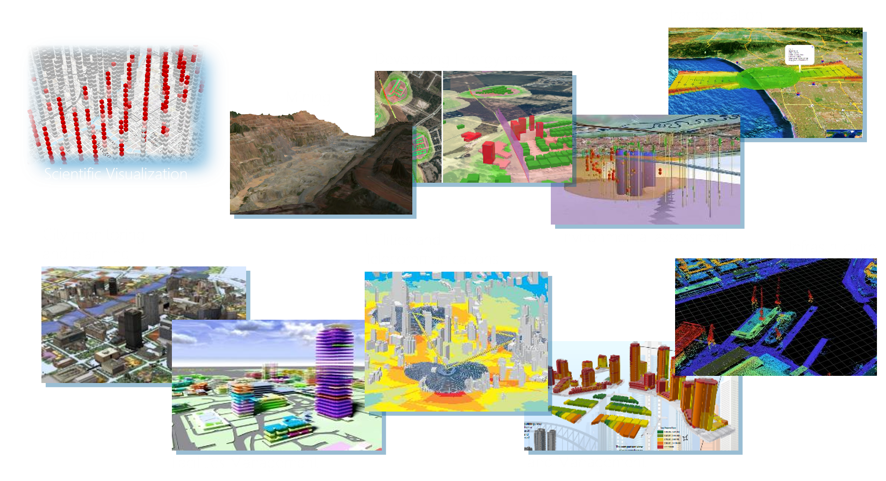
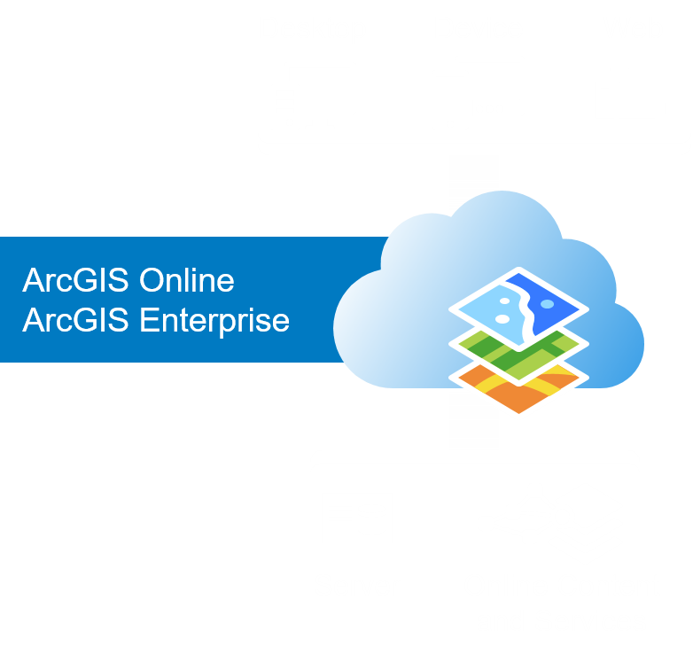
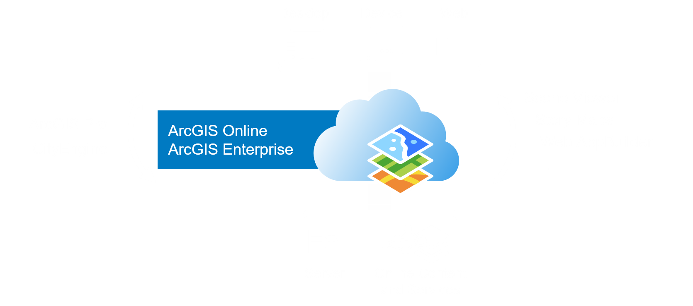
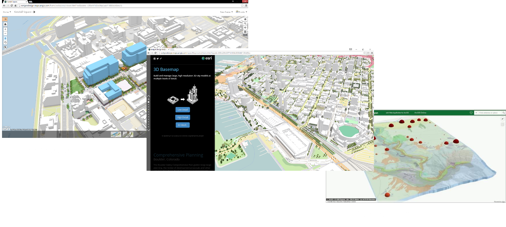
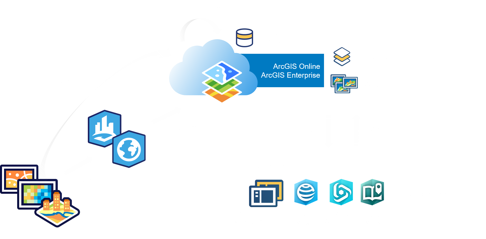
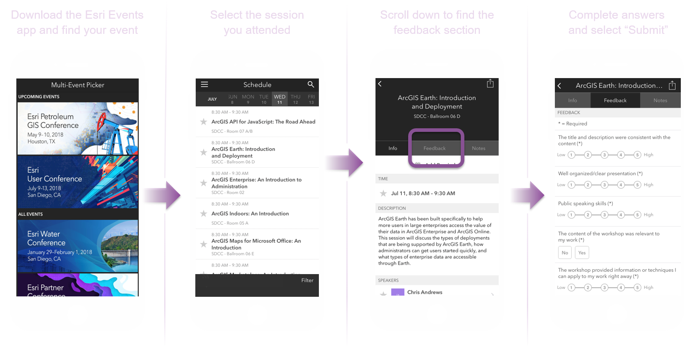

<!-- .slide: data-background="../images/bg-1.png" -->

## Building 3D Apps   with ArcGIS API for JavaScript

Veronika Landers - Yannik Messerli - Johannes Schmidt

---

<!-- .slide: data-background="../images/bg-2.png" -->

### <b> 3D GIS across industries</b>

 

---

<!-- .slide: data-background="../images/bg-2.png" -->

### <b> 3D GIS across industries</b>

 

<iframe id="scene-view-map-view" data-src="https://www.arcgis.com/home/webscene/viewer.html?webscene=c5b58fa63714412eb0eea933a130ebdf&ui=min" height=500 align=left></iframe>

<iframe id="scene-view-map-view" data-src="https://www.arcgis.com/home/webscene/viewer.html?webscene=43e1b988e55a44fdad6c5cf58c34dbda&ui=min" height=500></iframe>

---

<!-- .slide: data-background="../images/bg-1.png" -->
### <b>Agenda</b>

- Introduction to 3D
- Build your app
- Extend your app
- Samples

---

<!-- .slide: data-background="../images/bg-4.png" -->

## <b>Introduction to 3D</b>

 

Veronika Landers

---

<!-- .slide: data-background="../images/bg-2.png" -->

### <b>The ArcGIS Platform</b>

---

<!-- .slide: data-background="../images/bg-2.png" -->

### <b>The ArcGIS 3D Platform</b>

---

<!-- .slide: data-background="../images/bg-2.png" -->

### <b>Esri Provides out-of-the-box 3D Web Apps</b>

---

<!-- .slide: data-background="../images/bg-2.png" -->

### <b>Building Apps with the ArcGIS 3D Platform</b>

---

<!-- .slide: data-background="../images/bg-2.png" -->

### <b>Build Your Own custom 3D Web Apps</b>

---

<!-- .slide: data-background="../images/bg-2.png" -->
### <b>ArcGIS JavaScript API</b>

 

---

<!-- .slide: data-background="../images/bg-2.png" -->
### <b>ArcGIS JavaScript API</b>

  - Visual mapping (2D & 3D), component and widgets
  - Support for various different layer types (data sources)
  - Integration with the ArcGIS platform
     (security, sign-in, premium services, …)

 

<b>Get it today</b>
- Hosted build https://js.arcgis.com/4.8   
- Doc/samples https://developers.arcgis.com/javascript

---

<!-- .slide: data-background="../images/bg-2.png" -->

### <b>Desktop 3D Requirements</b>

 

- Modern hardware, especially Graphics Card

- Latest web browsers with WebGL support
  - Chrome
  - Edge / Internet Explorer 11\* (\*WebGL not optimized)
  - Firefox
  - Safari

---

<!-- .slide: data-background="../images/bg-2.png" -->

### <b>Mobile 3D Requirements</b>

 

- Mobile support for the following devices
  - iOS — iPhone 8, iPad Pro (Safari)
  - Android — Samsung S8/S9 (Chrome)
  - Android - Samsung Tab S3 (Chrome)

- Other devices *only at your own risk* :)

---

<!-- .slide: data-background="../images/bg-2.png" -->

### <b>Provide content for your apps (1)</b>

1. Process data
2. Publish data - individually or as a web scene
3. Configure and schedule cache generation
4. Integrate and configure layers for multiple usage on the web

---

<!-- .slide: data-background="../images/bg-2.png" -->

### <b>Provide content for your apps (2)</b>

---

<!-- .slide: data-background="../images/bg-2.png" -->

### <b>Global and local scenes</b>

- Cached data for faster rendering with dynamic data on the fly

- Global scenes for *full globe visualizations*
  
  Choose one of two geographic coordinate systems
  - WebMercator (wkid: 3857)
  - WGS84 (wkid: 4326)

- Local scenes for *local cartesian visualizations*
  
  Choose any projected coordinate system

  Clip to your area of interest

---

<!-- .slide: data-background="../images/bg-2.png" -->

### <b>Ground</b>

- Elevation surface
- Draped layers
- NEW render just a solid color

---

<!-- .slide: data-background="../images/bg-2.png" -->

### <b>Navigation</b>

---

<!-- .slide: data-background="../images/bg-2.png" -->

### <b>Light & Shadows</b>

- 

---

<!-- .slide: data-background="../images/bg-2.png" -->

### <b>Web Scenes Concept</b>

- Vehicle for cross platform 3D capabilities
- Collection of layers, environment settings, slides
- Read and write Web Scenes across the ArcGIS platform
  - Scene Viewer
  - Web AppBuilder and Templates (read only)
  - Story Maps (read only)
  - ArcGIS Pro
  - ArcGIS Runtime
  - ArcGIS Javascript API
 
---

<!-- .slide: data-background="../images/bg-2.png" -->

### <b>Web Scenes Specification</b>

- Defines the content of a Web Scene
- Follows a specification (similar to Web Map)
- Serialized as JSON
- Stored in ArcGIS Online or Enterprise (Portal)
- Operational layers (with styling overrides) 
- Base map, slides, initial state (position and light)
- Metadata: scene type, spatial reference, version...

---

<!-- .slide: data-background="../images/bg-2.png" -->

### <b>Summary</b>

- 2D and 3D data can be visualized globally and locally.

- Ground represents the earth surface.

- Camera is used for specific views and navigation.

- 3D allows you to light up and render shadows.

- 3D on the web requires latest technology.

---

<!-- .slide: data-background="../images/bg-4.png" -->

## <b>Building your first App</b>

 

with ArcGIS API for JavaScript

 

Yannik Messerli

---

<!-- .slide: data-background="../images/bg-5.png" -->

### Topics

- Loading the webscene
- Add a layer
- Add a widget

---

<!-- .slide: data-background="../images/bg-6.png" -->

## Loading the webscene

### Creating basic HTML file

  

    

    <pre><code style="margin-bottom: -30px;" class="lang-html">
    &lt;!DOCTYPE html&gt;
    &lt;html&gt;
    &lt;head&gt;
      &lt;meta charset=&quot;utf-8&quot;&gt;
    </code>
    <code style="margin-bottom: -30px;" class="grey">
      &lt;link rel=&quot;stylesheet&quot; href=&quot;//jsdev.arcgis.com/4.8/esri/css/main.css&quot;&gt;
      &lt;script src=&quot;//jsdev.arcgis.com/4.8/&quot;&gt;&lt;/script&gt;
    </code>
    <code style="margin-bottom: -30px;" class="lang-html">
      &lt;title&gt;Create a 3D map&lt;/title&gt;
    &lt;/head&gt;
    &lt;body&gt;
      &lt;script&gt;
    </code>
    <code style="margin-bottom: -30px;" class="grey">
        require([
          "esri/WebScene",
          "esri/views/SceneView",
          "dojo/domReady!"
        ], function(WebScene, SceneView) {
          var scene = new WebScene({
            portalItem: {
              id: "3a9976baef9240ab8645ee25c7e9c096"
            }
          });
          var view = new SceneView({
            container: "viewDiv",
            map: scene
          });
        });
    </code>
    <code class="lang-html">
      &lt;/script&gt;
      &lt;div id=&quot;viewDiv&quot;&gt;&lt;/div&gt;
    &lt;/body&gt;
    &lt;/html&gt;
    </code></pre>
    

  

  

    <iframe id="scene-view-map-view"></iframe>
  

---

<!-- .slide: data-background="../images/bg-6.png" -->

## Loading the webscene

### Reference the ArcGIS API for JavaScript

  

    <pre><code style="margin-bottom: -30px;" class="grey">
    &lt;!DOCTYPE html&gt;
    &lt;html&gt;
    &lt;head&gt;
      &lt;meta charset=&quot;utf-8&quot;&gt;
    </code>
    <code style="margin-bottom: -30px;" class="lang-html">
      &lt;link rel=&quot;stylesheet&quot; href=&quot;//jsdev.arcgis.com/4.8/esri/css/main.css&quot;&gt;
      &lt;script src=&quot;//jsdev.arcgis.com/4.8/&quot;&gt;&lt;/script&gt;
    </code>
    <code style="margin-bottom: -30px;" class="grey">
      &lt;title&gt;Create a 3D map&lt;/title&gt;
    &lt;/head&gt;
    &lt;body&gt;
      &lt;script&gt;
    </code>
    <code style="margin-bottom: -30px;" class="grey">
        require([
          "esri/WebScene",
          "esri/views/SceneView",
          "dojo/domReady!"
        ], function(WebScene, SceneView) {
          var scene = new WebScene({
            portalItem: {
              id: "3a9976baef9240ab8645ee25c7e9c096"
            }
          });
          var view = new SceneView({
            container: "viewDiv",
            map: scene
          });
        });
    </code>
    <code class="grey">
      &lt;/script&gt;
      &lt;div id=&quot;viewDiv&quot;&gt;&lt;/div&gt;
    &lt;/body&gt;
    &lt;/html&gt;
    </code></pre>
    

  

  

    <iframe id="scene-view-map-view"></iframe>
  

---

<!-- .slide: data-background="../images/bg-6.png" -->

## Loading the webscene

### Load the module

  

    <pre><code style="margin-bottom: -30px;" class="grey">
    &lt;!DOCTYPE html&gt;
    &lt;html&gt;
    &lt;head&gt;
      &lt;meta charset=&quot;utf-8&quot;&gt;
    </code>
    <code style="margin-bottom: -30px;" class="grey">
      &lt;link rel=&quot;stylesheet&quot; href=&quot;//jsdev.arcgis.com/4.8/esri/css/main.css&quot;&gt;
      &lt;script src=&quot;//jsdev.arcgis.com/4.8/&quot;&gt;&lt;/script&gt;
    </code>
    <code style="margin-bottom: -30px;" class="grey">
      &lt;title&gt;Create a 3D map&lt;/title&gt;
    &lt;/head&gt;
    &lt;body&gt;
      &lt;script&gt;
    </code>
    <code style="margin-bottom: -30px;" class="lang-js">
        require([
          "esri/WebScene",
          "esri/views/SceneView",
          "dojo/domReady!"
        ], function(WebScene, SceneView) {
    </code>
    <code style="margin-bottom: -30px;" class="grey">
          var scene = new WebScene({
            portalItem: {
              id: "3a9976baef9240ab8645ee25c7e9c096"
            }
          });
          var view = new SceneView({
            container: "viewDiv",
            map: scene
          });
    </code>
    <code style="margin-bottom: -30px;" class="lang-js">
        });
    </code>
    <code class="grey">
      &lt;/script&gt;
      &lt;div id=&quot;viewDiv&quot;&gt;&lt;/div&gt;
    &lt;/body&gt;
    &lt;/html&gt;
    </code></pre>
    

  

  

    <iframe id="scene-view-map-view"></iframe>
  

---

<!-- .slide: data-background="../images/bg-6.png" -->

## Loading the webscene

### Create the webscene

  

    <pre><code style="margin-bottom: -30px;" class="grey">
    &lt;!DOCTYPE html&gt;
    &lt;html&gt;
    &lt;head&gt;
      &lt;meta charset=&quot;utf-8&quot;&gt;
    </code>
    <code style="margin-bottom: -30px;" class="grey">
      &lt;link rel=&quot;stylesheet&quot; href=&quot;//jsdev.arcgis.com/4.8/esri/css/main.css&quot;&gt;
      &lt;script src=&quot;//jsdev.arcgis.com/4.8/&quot;&gt;&lt;/script&gt;
    </code>
    <code style="margin-bottom: -30px;" class="grey">
      &lt;title&gt;Create a 3D map&lt;/title&gt;
    &lt;/head&gt;
    &lt;body&gt;
      &lt;script&gt;
    </code>
    <code style="margin-bottom: -30px;" class="grey">
        require([
          "esri/WebScene",
          "esri/views/SceneView",
          "dojo/domReady!"
        ], function(WebScene, SceneView) {
    </code>
    <code style="margin-bottom: -30px;" class="lang-js">
          var scene = new WebScene({
            portalItem: {
              id: "3a9976baef9240ab8645ee25c7e9c096"
            }
          });
    </code>
    <code style="margin-bottom: -30px;" class="grey">
          var view = new SceneView({
            container: "viewDiv",
            map: scene
          });
        });
    </code>
    <code class="grey">
      &lt;/script&gt;
      &lt;div id=&quot;viewDiv&quot;&gt;&lt;/div&gt;
    &lt;/body&gt;
    &lt;/html&gt;
    </code></pre>
    

  

  

    <iframe id="scene-view-map-view"></iframe>
  

---

<!-- .slide: data-background="../images/bg-6.png" -->

## Loading the webscene

### Create the view

  

    <pre><code style="margin-bottom: -30px;" class="grey">
    &lt;!DOCTYPE html&gt;
    &lt;html&gt;
    &lt;head&gt;
      &lt;meta charset=&quot;utf-8&quot;&gt;
    </code>
    <code style="margin-bottom: -30px;" class="grey">
      &lt;link rel=&quot;stylesheet&quot; href=&quot;//jsdev.arcgis.com/4.8/esri/css/main.css&quot;&gt;
      &lt;script src=&quot;//jsdev.arcgis.com/4.8/&quot;&gt;&lt;/script&gt;
    </code>
    <code style="margin-bottom: -30px;" class="grey">
      &lt;title&gt;Create a 3D map&lt;/title&gt;
    &lt;/head&gt;
    &lt;body&gt;
      &lt;script&gt;
    </code>
    <code style="margin-bottom: -30px;" class="grey">
        require([
          "esri/WebScene",
          "esri/views/SceneView",
          "dojo/domReady!"
        ], function(WebScene, SceneView) {
    </code>
    <code style="margin-bottom: -30px;" class="grey">
          var scene = new WebScene({
            portalItem: {
              id: "3a9976baef9240ab8645ee25c7e9c096"
            }
          });
    </code>
    <code style="margin-bottom: -30px;" class="lang-js">
          var view = new SceneView({
            container: "viewDiv",
            map: scene
          });
    </code>
    <code style="margin-bottom: -30px;" class="grey">
        });
      &lt;/script&gt;
      &lt;div id=&quot;viewDiv&quot;&gt;&lt;/div&gt;
    &lt;/body&gt;
    &lt;/html&gt;
    </code></pre>
    

  

  

    <iframe id="scene-view-map-view"></iframe>
  

---

<!-- .slide: data-background="../images/bg-6.png" -->

## Loading the webscene

### That's it

  

    <pre><code style="margin-bottom: -30px;" class="lang-html">
    &lt;!DOCTYPE html&gt;
    &lt;html&gt;
    &lt;head&gt;
      &lt;meta charset=&quot;utf-8&quot;&gt;
    </code>
    <code style="margin-bottom: -30px;" class="lang-html">
      &lt;link rel=&quot;stylesheet&quot; href=&quot;//jsdev.arcgis.com/4.8/esri/css/main.css&quot;&gt;
      &lt;script src=&quot;//jsdev.arcgis.com/4.8/&quot;&gt;&lt;/script&gt;
    </code>
    <code style="margin-bottom: -30px;" class="lang-html">
      &lt;title&gt;Create a 3D map&lt;/title&gt;
    &lt;/head&gt;
    &lt;body&gt;
      &lt;script&gt;
    </code>
    <code style="margin-bottom: -30px;" class="lang-js">
        require([
          "esri/WebScene",
          "esri/views/SceneView",
          "dojo/domReady!"
        ], function(WebScene, SceneView) {
          var scene = new WebScene({
            portalItem: {
              id: "3a9976baef9240ab8645ee25c7e9c096"
            }
          });
          var view = new SceneView({
            container: "viewDiv",
            map: scene
          });
        });
    </code>
    <code class="lang-html">
      &lt;/script&gt;
      &lt;div id=&quot;viewDiv&quot;&gt;&lt;/div&gt;
    &lt;/body&gt;
    &lt;/html&gt;
    </code></pre>
    

  

  

    <iframe id="scene-view-map-view" data-src="./snippets/setup-snippet-1.html" ></iframe>
  

---

<!-- .slide: data-background="../images/bg-4.png" -->

## Details about the `Webscene` class

- `Layers`, `Slides`, ...
- `Basemap` is exactly the same concept as in 2D
- `Ground` defines the ground surface of the scene

---

<!-- .slide: data-background="../images/bg-8.png" -->

## Layers

| Layer type   | Characteristics | |
|--------------|-----------------|-|
| `FeatureLayer` | vector | <small>2d & 3D</small> |
| `CSVLayer` | vector | <small>2d & 3D</small> |
| `StreamLayer` | vector | <small>2d & 3D</small> |
| `MapImageLayer` | dynamic | <small>2d & 3D</small> |
| `ImageryLayer` | dynamic | <small>2d & 3D</small> |
| `WMSLayer` | dynamic | <small>2d & 3D</small> |
| `OpenStreetMapLayer` | raster, cached | <small>2d & 3D</small> |
| `TileLayer` | raster, cached | <small>2d & 3D</small> |
| `WebTileLayer` | raster, cached | <small>2d & 3D</small> |
| `WMTSLayer` | raster, cached | <small>2d & 3D</small> |
| `VectorTileLayer` | vector, cached | <small>2d & 3D</small> |
| `ElevationLayer` | raster, cached | <small> 3D only</small> |
| `SceneLayer` | vector | <small> 3D only</small> |
| `IntegratedMeshLayer` | vector | <small> 3D only</small> |
| `PointCloudLayer` | vector | <small> 3D only</small> |

---

<!-- .slide: data-background="../images/bg-8.png" -->

## Layers

| Layer type   | Characteristics | |
|--------------|-----------------|-|
| 
`FeatureLayer`
 | vector | <small>2d & 3D</small> |
| `CSVLayer` | vector | <small>2d & 3D</small> |
| `StreamLayer` | vector | <small>2d & 3D</small> |
| `MapImageLayer` | dynamic | <small>2d & 3D</small> |
| `ImageryLayer` | dynamic | <small>2d & 3D</small> |
| `WMSLayer` | dynamic | <small>2d & 3D</small> |
| `OpenStreetMapLayer` | raster, cached | <small>2d & 3D</small> |
| `TileLayer` | raster, cached | <small>2d & 3D</small> |
| `WebTileLayer` | raster, cached | <small>2d & 3D</small> |
| `WMTSLayer` | raster, cached | <small>2d & 3D</small> |
| `VectorTileLayer` | vector, cached | <small>2d & 3D</small> |
| `ElevationLayer` | raster, cached | <small> 3D only</small> |
| `SceneLayer` | vector | <small> 3D only</small> |
| `IntegratedMeshLayer` | vector | <small> 3D only</small> |
| `PointCloudLayer` | vector | <small> 3D only</small> |

---

<!-- .slide: data-background="../images/bg-4.png" -->

## Adding a layer

  

    <pre><code style="margin-bottom: -40px;" class="grey">
        require([
          "esri/WebScene",
          "esri/views/SceneView",
    </code>
    <code style="margin-bottom: -40px;" class="lang-js">
          "esri/layers/FeatureLayer",
    </code>
    <code style="margin-bottom: -40px;" class="grey">
          "dojo/domReady!"
    </code>
    <code style="margin-bottom: -40px;" class="lang-js">
        ], function(WebScene, SceneView, FeatureLayer) {
    </code>
    <code style="margin-bottom: -40px;" class="grey">
          var scene = new WebScene({
            portalItem: {
              id: "3a9976baef9240ab8645ee25c7e9c096"
            }
          });
          var view = new SceneView({
            container: "viewDiv",
            map: scene
          });
    </code>
    <code style="margin-bottom: -40px;" class="lang-js">
          var layer = new FeatureLayer({
            portalItem: {
              id: "3a9976baef9240ab8645ee25c7e9c096"
            }
          });
          scene.add(layer);
    </code>
    <code class="grey">
        });
    </code></pre>
    

  

  

    <iframe id="scene-view-map-view" ></iframe>
  

---

<!-- .slide: data-background="../images/bg-4.png" -->

## Adding a layer

  

    <pre><code class="lang-js">
        require([
          "esri/WebScene",
          "esri/views/SceneView",
          "esri/layers/FeatureLayer",
          "dojo/domReady!"
        ], function(WebScene, SceneView, FeatureLayer) {
          var scene = new WebScene({
            portalItem: {
              id: "3a9976baef9240ab8645ee25c7e9c096"
            }
          });
          var view = new SceneView({
            container: "viewDiv",
            map: scene
          });
          var layer = new FeatureLayer({
            portalItem: {
              id: "3a9976baef9240ab8645ee25c7e9c096"
            }
          });
          scene.add(layer);
        });
    </code></pre>
    

  

  

    <iframe id="scene-view-map-view" data-src="./snippets/setup-snippet-2.html"></iframe>
  

---

<!-- .slide: data-background="../images/bg-7.png" -->

## Widgets

Widgets are UI components that add functionalities to your scene.  The API provides ready-to-use widgets, for example:

- `Legend` widget: provides extra information your scene and your layers
- `LayerList` widget: lists your scene's layers with an easy way toggle them on/off
- `Search` widget: enables search for features and locations within your scene
- ...

---

<!-- .slide: data-background="../images/bg-7.png" -->

## Adding a widget

  

    <pre><code style="margin-bottom: -40px;" class="grey">
        require([
          "esri/WebScene",
          "esri/views/SceneView",
          "esri/layers/FeatureLayer",
    </code>
    <code style="margin-bottom: -40px;" class="lang-js">
          "esri/widgets/Search",
    </code>
    <code style="margin-bottom: -40px;" class="grey">
          "dojo/domReady!"
        ], function(
          WebScene, 
          SceneView, 
          FeatureLayer,
    </code>
    <code style="margin-bottom: -40px;" class="lang-js">
          Search
        ) {
    </code>
    <code style="margin-bottom: -40px;" class="grey">

          ...

    </code>
    <code style="margin-bottom: -40px;" class="lang-js">
          var searchWidget = new Search({
            view: view
          });
          view.ui.add(searchWidget, {
            position: "top-right"
          });
    </code>
    <code class="grey">
        });
    </code></pre>
    

  

  

    <iframe id="scene-view-map-view" ></iframe>
  

---

<!-- .slide: data-background="../images/bg-7.png" -->

## Adding a widget

  

    <pre><code class="lang-js">
        require([
          "esri/WebScene",
          "esri/views/SceneView",
          "esri/layers/FeatureLayer",
          "esri/widgets/Search",
          "dojo/domReady!"
        ], function(
          WebScene, 
          SceneView, 
          FeatureLayer,
          Search
        ) {

          ...

          var searchWidget = new Search({
            view: view
          });
          view.ui.add(searchWidget, {
            position: "top-right"
          });
        });
    </code></pre>
    

  

  

    <iframe id="scene-view-map-view" data-src="./snippets/setup-snippet-3.html"></iframe>
  

---

<!-- .slide: data-background="../images/bg-7.png" -->

## Popups

  

      The popup widget allows users to view content from the feature attributes. 
  

  

    <iframe id="scene-view-map-view" data-src="./snippets/setup-snippet-3.html"></iframe>
  

---

<!-- .slide: data-background="../images/bg-7.png" -->

## Intro to popup

  

    <pre><code class="lang-js">
      view.on("click", function(event) {
        event.stopPropagation();
        view.popup.open({
          title: "Reverse geocode: [" + lon + ", " + lat + "]",
          location: event.mapPoint
        });
      });
    </code></pre>
    

  

  

    <iframe id="scene-view-map-view" data-src="./snippets/setup-snippet-4.html"></iframe>
  

---

<!-- .slide: data-background="../images/bg-7.png" -->

## Adding a popup template for your attributes

  

    - Each view has a popup associated with it
    - You can custom the popup display using the `PopupTemplate`
    

      <pre><code class="lang-js">
        var template = {
          title: "Marriage in NY, Zip Code: {ZIP}",
          content: [{
            type: "fields",
            fieldInfos: [{
              fieldName: "MARRIEDRATE",
              label: "Married %",
              visible: true
            }]
          }]
        };
        layer.popupTemplate = template;
      </code></pre>
    

  

  

    <iframe id="scene-view-map-view" data-src="./snippets/setup-snippet-5.html"></iframe>
  

---

<!-- .slide: data-background="../images/bg-4.png" -->

## <b>Extend your App</b>

 

Johannes Schmid

---

<!-- .slide: data-background="../images/bg-1.png" -->

## <b>And much more...</b> 

 

Checkout the documentation at [https://developers.arcgis.com/javascript/](https://developers.arcgis.com/javascript/)

 

It's only the beginning...

---

<!-- .slide: data-background="../images/bg-1.png" -->

## <b>Demos</b> 

 

of 3D applications

 

Veronika Landers - Johannes Schmidt - Yannik Messerli

---

<!-- .slide: data-background="../images/bg-5.png" -->

### Topics

- Skyscrapper explorer
- Hiking App
- [C-Through](https://esri.github.io/c-through/)
- [Satellite map](http://richiecarmichael.github.io/sat/index.html)
- [Landsat viewer](https://richiecarmichael.github.io/landsat-viewer/index.html)

---

<!-- .slide: data-background="../images/bg-9.png" -->

### Thank you

<iframe id="scene-view-map-view" data-src="http://www.arcgis.com/home/webscene/viewer.html?webscene=49345e11fbf041dfb791b58d3baf7905&ui=min" style="width:30%;height:30%;"</iframe>

---

<!-- .slide: data-background="../images/bg-2.png" -->

### Please Take Our Survey on the App

---

<!-- .slide: data-background="../images/bg-8.png" -->

